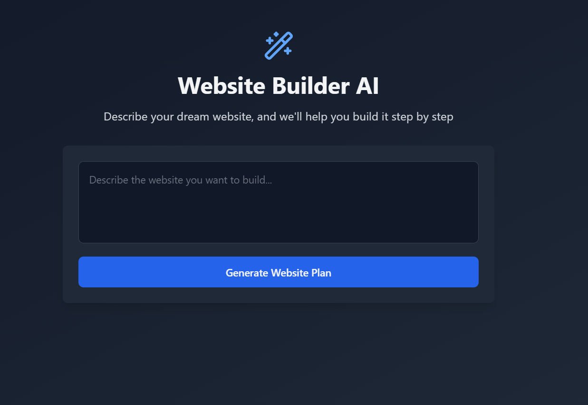

Here's a README.md file tailored to your project:

---

# Website Builder AI

A powerful and intuitive tool designed to simplify the process of creating websites. This project demonstrates the use of modern technologies like React, Node.js, and the Claude API to deliver a seamless user experience.



<!-- Replace with the actual relative path to your uploaded image -->

## Features

- **React Frontend**: A responsive and user-friendly interface.
- **Node.js Backend**: Handles all server-side logic and interactions.
- **Claude SDK Integration**: Generates intelligent responses and actions using Anthropic's Claude API.
- **Modern Web Containers**: Ensures isolated and efficient workflows.
- **Custom Hooks**: Simplifies React component logic.
- **Streamlined Development Workflow**: Run both the frontend and backend easily with npm commands.

## Project Structure

```
root/
├── frontend/    # React application for the user interface
├── backend/     # Node.js application for server-side logic
└── README.md    # Project documentation
```

## Prerequisites

1. **API Key**:  
   To run the backend, you need an API key from [Anthropic Claude](https://www.anthropic.com/claude).  
   Generate your API key and add it to a `.env` file in the `backend` directory:

   ```
   CLAUDE_API_KEY=your-anthropic-api-key
   ```

2. **Node.js & npm**:  
   Ensure you have Node.js and npm installed on your machine.

## Installation and Setup

1. Clone this repository:

   ```bash
   git clone https://github.com/your-username/website-builder-ai.git
   cd website-builder-ai
   ```

2. Set up the **Frontend**:

   ```bash
   cd frontend
   npm install
   npm run dev
   ```

3. Set up the **Backend**:

   ```bash
   cd backend
   npm install
   npm run dev
   ```

4. Open your browser and navigate to `http://localhost:3000` to see the project in action.

## Concepts Covered

- **Web Containers**: For seamless development and deployment.
- **Claude SDK**: Integrating intelligent API-powered features.
- **React Hooks**: Enhancing functionality and state management.
- **API Handling**: Efficient server-to-client communication.

## Contributing

Feel free to fork this repository, make improvements, and submit a pull request. Contributions are welcome!

## License

This project is licensed under the [MIT License](LICENSE).

## Acknowledgments

- [Anthropic Claude](https://www.anthropic.com/claude) for their API.
- Open-source community for contributions and tools.

---

Let me know if you'd like to refine it further!
